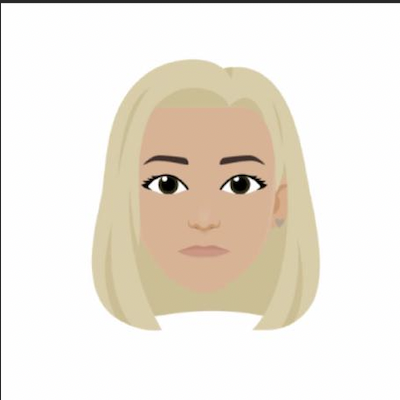

# Yulyana Ramanenka 


## Junior Frontend Developer

---

### Contact information
**Phone:** +447504025051\
**E-mail:** yul.ramanenka@gmail.com\
**[Linkedin](https://www.linkedin.com/in/yulyana-ramanenka/)**

---

### About me

I’ve been working as a Quality Assurance engineer for over 3,5 years so far. As the next step in my career, I'm keen on gaining knowledge in FE development.\
\
Having worked for a digital agency and a product-focused company I have experience working on short-term, long-term
projects and products.\
\
Throughout my career, I’m involved in the testing of web applications and their APIs, I’ve been exposed to test automation on Cypress.\
\
I work with developers, project managers and product owners, design and UX teams. I'm involved in sprint planning meetings, daily stand-ups, task kick-off and sign-off meetings, tech refinement and bug triage meetings, design documentation reviews and retrospective meetings.\
\
I also took part in the open-source project ([Mattermost](https://github.com/yulyanaR)).

---

### Skills

* HTML5, CSS3, JS
* VS Code, IntelliJ IDEA
* SQL, Oracle
* Postman, Charles Proxy
* Cypress, Protractor
* Git
* JIRA
* Figma, Sketch, InVision

---

### Code example
Write a function to convert a name into initials. This kata strictly takes two words with one space in between them.\
The output should be two capital letters with a dot separating them.\
It should look like this:\
Sam Harris => S.H\
patrick feeney => P.F
```
function abbrevName(name) {
    return name.split(" ").map((n, i, a) =>
        i === 0 || i + 1 === a.length ? n[0] : null).join(".").toUpperCase();
}
```

---

### Experience
* Quality Assurance Engineer - Rightmove LTD, January 2022 - Present
* Quality Assurance Analyst - Phantom Studios LTD, March 2020 - January 2022
* Junior Quality Assurance Analyst - Phantom Studios LTD, May 2018 - March 2020
* Pharmacist August 2015 - December 2017

---

### Education
Vitebsk State Medical University 2010 – 2015\
Bachelor in Pharmaceutical Science
### Courses & Certifications
* [ISTQB Certified Tester, Foundation Level, UK & Ireland Testing Board](http://scr.istqb.org/?name=&number=19-CTFL-168101-06&orderBy=relevancy&orderDirection=&dateStart=&dateEnd=&expiryStart=&expiryEnd=&certificationBody=&examProvider=&certificationLevel=&country=&resultsPerPage=10)
* [User Experience: The Beginner’s Guide,  Interaction Design Foundation (IxDF)](https://www.interaction-design.org/yulyana-ramanenka/certificate/course/dae7edbe-3053-463d-b861-096369e27365)
* [Accessibility: How to Design for All, Interaction Design Foundation (IxDF)](https://www.interaction-design.org/yulyana-ramanenka/certificate/course/f16f488a-ea47-4f56-ae73-b19e740c7f69)
* [Mobile User Experience (UX) Design, Interaction Design Foundation (IxDF)](https://www.interaction-design.org/yulyana-ramanenka/certificate/course/6cd3df85-2c2c-41b1-aa9e-8b69f432956b)

---

### Languages
**English**
* [Advanced level (CEFR C1) - Streamline Language School](https://str.by/cert-web/uploads/certificates/4D5D5F94DF8F99B3EDBB30770AF24810.pdf)
* Over 3,5 years of work experience for the UK-based companies
